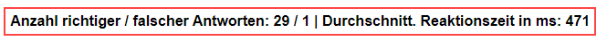
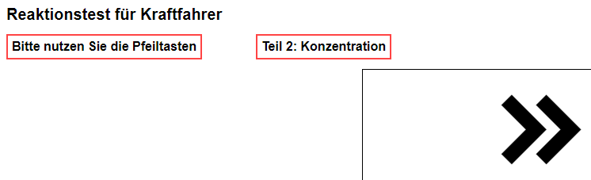

# Reaktionstest für Kraftfahrer
Ein online Reaktionstest für Kraftfahrer (LKW, Bus etc.).  
Frontend in JS ohne Backend.  
Die Webapp habe ich für meinen Vater geschrieben, deswegen ist der Test nur in deutsch.  
## Benutzung
Man öffnet den Link https://waldemarschroeder.github.io/ (aktuell geht das noch).  
oder man downloadet dieses Repo und öffnet index.html im Browser.  

